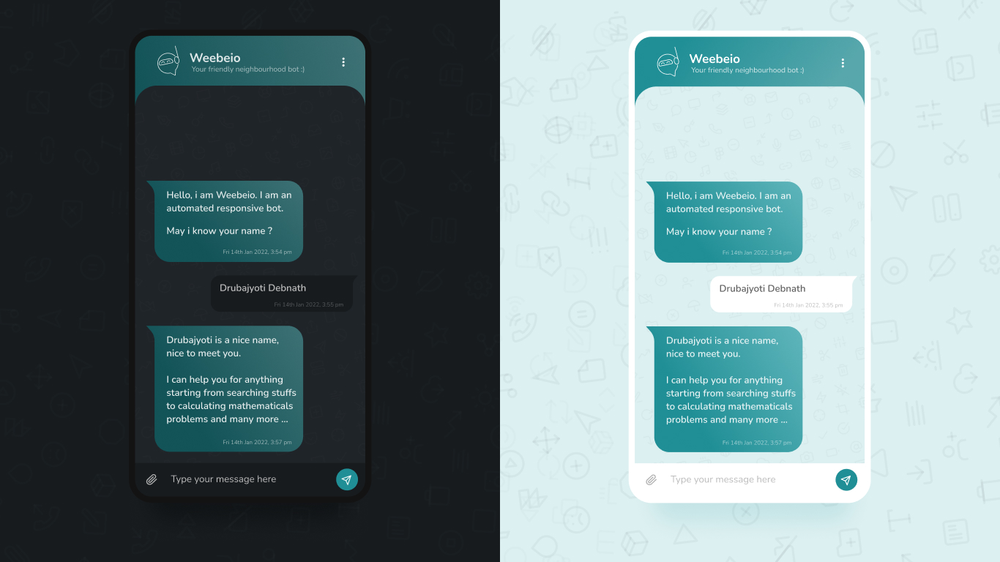

# Weebeio ChatBot



**Weebeio** is a lightweight Flask-based Machine Learning chatbot server using **ChatterBot** and **SQLite**.

## Overview

The code implements a Flask server exposing endpoints used by a front-end (HTML/CSS/JS) to:

* Send user messages and receive a chatbot reply (powered by ChatterBot).
* Ask the bot questions about its name (special handling).
* Check if a word exists in a dictionary JSON (spell-check style endpoint).
* Train the bot with new conversation lists.
* Verify a security code.

The bot runs with a `sqlite` database using `chatterbot.storage.SQLStorageAdapter`. The main `ChatBot` configuration sets two logic adapters: `BestMatch` (with a fallback default response `drb_cant`) and `MathematicalEvaluation`.

## Dependencies

Minimum dependencies used in code:

* Python 3.8+ (recommended)
* Flask
* flask-cors
* chatterbot
* sqlalchemy

Example `requirements.txt`:

```
Flask>=2.0
Flask-Cors>=3.0
chatterbot>=1.0.8
SQLAlchemy>=1.4
```

> **Important**: Installing `chatterbot` sometimes requires extra steps on newer Python versions (some users pin versions or use forks). See the Troubleshooting section.

---

## Install & Run (local)

1. Create & activate a Python virtual environment:

```bash
cd ServerSide
python -m venv venv
source venv/bin/activate   # Linux / macOS
venv\Scripts\activate     # Windows
```

2. Install requirements:

```bash
pip install -r requirements.txt
```

3. Ensure `data_feed/words_dictionary.json` exists and contains a valid JSON object (used by `/api/wrongWords`).

4. Run the Flask server (example):

```bash
export FLASK_APP=chat.py
export FLASK_ENV=development
flask run --host=0.0.0.0 --port=5000
```

Or run directly with Python:

```bash
python app.py
```

You should see the simple index route at `http://localhost:5000/` returning `<h1>ChatBot Server</h1>`.

---

## API Endpoints (detailed)

*All endpoints are POST unless stated otherwise. The server expects JSON bodies.*

### 1. `GET /` — index

Returns a tiny HTML string to show the server is running.

### 2. `POST /api/response`

**Request body** (JSON):

```json
{ "newMessage": "hello" }
```

**Behavior**:

* Normalizes message and passes to `bot.get_response(user_input)`.
* If the message contains variations of the bot name / asks for the name (special logic), it returns a crafted response like: `Weebeio is what my developers called me :)`.
* If message is empty or blank, returns: `Bot : Could you write something for me to response -_-`

**Example response**:

```json
{ "message": "Hello! How can I help you today?" }
```

### 3. `POST /api/wrongWords`

**Request body**:

```json
{ "sentence": "helo" }
```

**Behavior**:

* Cleans the message and loads `data_feed/words_dictionary.json`.
* Checks if the **first** word (after cleaning) exists in the JSON keys.
* Returns a boolean `true`/`false` in `message` indicating whether the word exists.

**Example response**:

```json
{ "message": false }
```

**Note**: Current implementation only checks the first word in the sentence. There's an outlined (commented) plan to check all words.

### 4. `POST /api/trainBot`

**Request body**:

```json
{ "conversation": ["hi", "hello" , "how are you?", "I am fine"] }
```

**Behavior**:

* Uses `ListTrainer(bot).train(returnData)` to add training data.
* Returns `{"message": true}` on success or `false` on error.

**Warning**: Training is synchronous and can be slow for large datasets.

### 5. `POST /api/securityCode`

**Request body**:

```json
{ "secCode": "secretkey" }
```

**Behavior**:

* Compares `secCode` with the server-side `secSaveCode` variable and returns a boolean.

**Example response**:

```json
{ "message": true }
```

## Example `requirements.txt` (full)

```
Flask>=2.0
Flask-Cors>=3.0
chatterbot>=1.0.8
SQLAlchemy>=1.4
```
